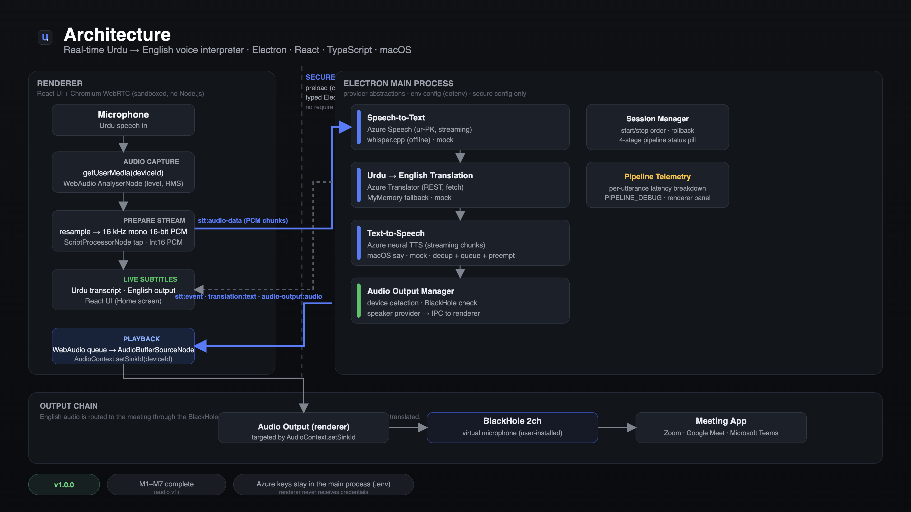

# Urdu-English Voice Interpreter

[](https://www.gnu.org/licenses/gpl-3.0)

Real-time Urdu → English voice interpretation for macOS meetings. Speak Urdu into
your microphone and the app shows the live Urdu transcript with its English
translation, speaks the English translation aloud, and can route that English
audio to a virtual microphone such as [BlackHole](https://existential.audio/blackhole/)
so Google Meet, Zoom, or Microsoft Teams hears it as your microphone input.

Only audio captured from your selected local microphone is translated. **Audio
from other meeting participants is never translated.**

## How it works

```text
Microphone (your Urdu speech)
        ↓
Speech-to-text (Urdu partials + finals)
        ↓
Urdu → English translation
        ↓
Live subtitles (Urdu transcript + English translation)
        ↓
Text-to-speech (English audio)
        ↓
Selected audio output (speakers / headphones / BlackHole)
        ↓
Meeting app sees BlackHole as a microphone
```

## Features

- **Live Urdu speech-to-text** — Azure Speech (streaming, interim partials) in
  production; offline [whisper.cpp](#local-whisper-stt-offline) and a
  deterministic mock in development.
- **Urdu → English translation** — Azure Translator in production; MyMemory
  (free, no signup) as a fallback; mock for local testing.
- **English text-to-speech** — Azure Neural TTS with streaming PCM and
  preemption; macOS `say` offline; mock for automated tests.
- **Live subtitles** — growing Urdu transcript plus the English translation.
- **Incremental translation** — updates from stable partials, replaced by the
  authoritative final translation.
- **Playback control** — deduplication, FIFO queue, bounded backpressure, and
  interruption of stale speech by newer speech.
- **Selectable audio output** — route translated English to speakers, headphones,
  or BlackHole; BlackHole is detected at runtime.
- **First-run onboarding** — a one-time "Get Ready" checklist verifies
  microphone permission, output device, and BlackHole (re-runnable from
  Settings).
- **Voice selection** — a searchable voice picker (Azure voices in production;
  macOS `say` voices additionally in development), persisted across restarts.
- **Focused UI** — a Home screen (Meeting Mode, Speech to Text, Translation) and
  a sidebar Settings page (Audio, Voice, Appearance, Performance, Diagnostics,
  Setup), light/dark/system themes, and centralized error toasts.
- **Secure by default** — Electron `contextIsolation: true`,
  `nodeIntegration: false`, typed `contextBridge` IPC; credentials never reach
  the renderer.
- **Development-only telemetry** — a Pipeline Performance panel and `[TELEMETRY]`
  logs when `PIPELINE_DEBUG=1`.
- **105 automated tests** covering the pipeline, providers, and UI state.

## Screenshots and demo

A 48-second silent walkthrough of the real app plus deterministic screenshots
captured from the built renderer (mock provider, no cloud credentials):

- **Video:** [`docs/demo/demo-v1.0.0.mp4`](docs/demo/demo-v1.0.0.mp4) (attached to the v1.0.0 release)
- **Poster:** [`docs/images/demo-poster.png`](docs/images/demo-poster.png)
- **Screenshots:** [Home / Meeting Mode](docs/images/app-overview.png) ·
  [live translation](docs/images/live-translation.png) ·
  [performance telemetry](docs/images/telemetry.png)
- **Architecture diagram:** [`docs/images/architecture.png`](docs/images/architecture.png)

The screenshots are generated by the deterministic demo harness in
[`demo/`](demo/README.md); see that README for how they are produced.

## Requirements

| Requirement | Notes |
| --- | --- |
| **macOS (Apple Silicon / arm64)** | The packaged builds target macOS arm64. |
| **Node.js 18+ and npm** | Development only. End users do not need Node. |
| **Azure Speech credentials** | Production STT + TTS (`AZURE_SPEECH_KEY`, `AZURE_SPEECH_REGION`). Optional if using Whisper / `say`. |
| **Azure Translator credentials** | Production translation (`AZURE_TRANSLATOR_KEY`, `AZURE_TRANSLATOR_REGION`). Optional if using MyMemory. |
| **BlackHole 2ch** | Optional. Needed only to route translated audio into a meeting app. |

The architecture is cross-platform-ready (provider abstractions, renderer-side
WebAudio), but only macOS is implemented and packaged today.

## Installation (end users)

Non-technical users do **not** need Node, npm, Terminal, or a `.env` file:

1. Open `Urdu English Interpreter-<version>-arm64.dmg` and drag the app into
   **Applications**.
2. Launch **Urdu English Interpreter** from Applications. The build is
   **unsigned**, so on first launch use right-click → **Open** (or System
   Settings → Privacy & Security → **Open Anyway**).
3. The **Get set up** panel walks through three checks:
   - **Microphone** — click *Allow Microphone*; if denied, click *Open System
     Settings* to re-enable it for the app.
   - **Audio output** — choose where the English audio should play.
   - **BlackHole** — install the free virtual microphone if you want to send the
     English audio into a meeting app (translation works locally without it).
4. When the panel says **Ready**, press **Start Meeting**.

Cloud credentials for the production path are read from
`~/.urdu-english-interpreter/.env` if provided, or from the process environment.
End users typically never create this file.

## Development setup

```bash
npm install
cp .env.example .env      # then fill in credentials (or use mock providers)
npm run dev               # watch build + Electron with renderer hot reload
```

Other useful commands:

```bash
npm start                 # build + launch Electron
npm run build             # esbuild bundle (main, preload, renderer) -> dist/
npm run watch             # rebuild only (no relaunch)
npm run type-check        # tsc --noEmit
npm test                  # automated test suite (tsx --test)
npm run lint              # ESLint (flat config)
npm run format            # Prettier --write
```

## Configuration

Configuration is read from the environment. In development, `dotenv` loads the
repository `.env` (created from [`.env.example`](.env.example)); shell
environment variables always take precedence and are never overwritten.

### Development vs production defaults

| Stage | STT | Translation | TTS |
| --- | --- | --- | --- |
| **Development** (`.env` absent) | `azure` | `mock` | `mock` |
| **Packaged** (runtime `.env` absent) | `azure` | `azure` | `azure` |

Development defaults to mock providers so a first run works without credentials.
**Packaged builds default to the real Azure providers** so a base install never
silently uses a mock; if credentials are missing, the app reports exactly what
to add instead of failing silently.

### Provider options

```dotenv
# Speech-to-text:  azure (default) | whisper (offline) | mock
STT_PROVIDER=azure
# Translation:    azure (default) | mymemory | mock
TRANSLATION_PROVIDER=azure
# Text-to-speech: azure (default) | say (macOS offline) | mock
TTS_PROVIDER=azure
```

- **Cloud (production):** `azure` for all three providers.
- **Local / demo:** `whisper` (offline STT), `say` (offline TTS), `mymemory`
  (free translation), or `mock` for any stage.

### Azure configuration

Production uses the Azure Speech service for **STT and TTS** (one key + region)
and Azure Translator for **translation** (a separate key + region):

```dotenv
AZURE_SPEECH_KEY=...
AZURE_SPEECH_REGION=eastus
AZURE_TRANSLATOR_KEY=...
AZURE_TRANSLATOR_REGION=eastus

# Optional
# AZURE_TTS_VOICE=en-US-JennyNeural
# AZURE_STT_SEGMENTATION_SILENCE_MS=300
```

- **Speech** (STT + TTS): create a Speech resource in the Azure portal. The
  free F0 tier includes 5 audio hours/month (STT) and 5M characters/month (TTS).
  STT locale is `ur-IN`.
- **Translator**: create a Translator resource (separate key/region). The free
  F0 tier includes 2M characters/month.
- MyMemory needs no key but is aggressively rate-limited — use it for
  development/fallback only, not sustained meeting traffic.

See [`.env.example`](.env.example) for every option (deduplication windows,
partial-translation tuning, telemetry, packaging/signing). **Never commit real
credentials.**

### Local Whisper STT (offline)

Fully offline Urdu STT with no API key or network, backed by whisper.cpp:

```bash
npm run setup:whisper     # builds whisper-cli and downloads the base model
# then set STT_PROVIDER=whisper
```

Whisper is not truly streaming — it decodes ~2-second windows — so it is slower
than Azure (first partial ~3.3–4.0 s with the base model) but needs no
credentials. Model and engine live under `~/.cache/urdu-english-interpreter/`.

### Both providers at once

A common setup: `STT_PROVIDER=whisper` (offline transcription) +
`TRANSLATION_PROVIDER=azure` (cloud translation) + `TTS_PROVIDER=azure`.

## BlackHole and meeting setup

1. Install **BlackHole 2ch**.
2. Launch the app and complete the **Get set up** panel (it verifies the
   microphone, output device, and BlackHole).
3. In Settings → Audio, select **BlackHole 2ch** as the audio output.
4. In Google Meet / Zoom / Teams, select **BlackHole 2ch** as the microphone.
5. Press **Start Meeting** and speak Urdu.

Translated English audio then reaches the meeting app through BlackHole. The
app performs device-based routing only — there is no meeting-app API
integration.

## Running, testing, and packaging

| Command | Purpose |
| --- | --- |
| `npm run dev` | Watch build + Electron with renderer hot reload (recommended for development). |
| `npm start` | Build once and launch Electron. |
| `npm run type-check` | TypeScript type checking (`tsc --noEmit`). |
| `npm test` | Automated tests (`tsx --test tests/*.test.ts`). |
| `npm run lint` / `npm run format` | ESLint / Prettier. |
| `npm run build` | Bundle main, preload, and renderer into `dist/`. |
| `npm run package:dir` | Production `.app` only, into `dist_electron/`. |
| `npm run package` | Production `.app` + DMG (arm64), into `dist_electron/`. |

## Production / packaged behavior

The packaged app bundles **only** `dist/`, `package.json`, and production
dependencies — never `.env`, source, tests, or docs. At runtime it reads a
user-owned config file at:

```dotenv
# ~/.urdu-english-interpreter/.env     (same variables as .env.example)
AZURE_SPEECH_KEY=...
AZURE_SPEECH_REGION=...
AZURE_TRANSLATOR_KEY=...
AZURE_TRANSLATOR_REGION=...
```

Process environment variables take precedence over this file. On launch the app
logs `[CONFIG] runtime config: …` and the resolved provider for each stage.

**Code signing / notarization** are configured but skipped in this environment
(builds are unsigned and require right-click → Open on first launch). To enable
signing, remove `"identity": null` from the `build` section of `package.json`,
set `CSC_LINK` / `CSC_KEY_PASSWORD`, and for notarization also set `APPLE_ID`,
`APPLE_APP_SPECIFIC_PASSWORD`, and `APPLE_TEAM_ID`.

## Troubleshooting

- **"Speech-to-text is not configured" / translation not configured** — the app
  names the exact file and variables to add. For a packaged build, add the Azure
  keys to `~/.urdu-english-interpreter/.env` and restart.
- **Translation shows the original Urdu text** — translation resolved to the
  mock provider (only possible if `TRANSLATION_PROVIDER=mock`). Set
  `TRANSLATION_PROVIDER=azure` (or `mymemory`) and provide credentials.
- **No English audio** — check `TTS_PROVIDER` and the Azure Speech
  credentials; a packaged build defaults to `azure` and reports missing keys.
- **BlackHole not detected** — install BlackHole 2ch, then restart the app and
  re-check Settings → Setup.
- **No microphone input** — grant microphone permission in System Settings →
  Privacy & Security → Microphone, then restart the app.
- **macOS blocks the app** — the build is unsigned; right-click → Open, or allow
  it in System Settings → Privacy & Security.
- **MyMemory rate limits (HTTP 429)** — expected on the free tier; the provider
  cools down and resumes. Use Azure Translator for sustained use.
- **`ScriptProcessorNode` deprecation warning in the console** — expected; the
  mic tap still works and is slated for an `AudioWorklet` migration.

## Architecture



A sandboxed React renderer captures the microphone and plays translated audio
back through WebAudio, communicating with the Electron main process only via the
typed `contextBridge` API (`window.electron`). Speech recognition, translation,
text-to-speech, and audio-output providers run in the main process; a session
manager orchestrates them behind a single Start/Stop contract. Each stage is
behind a provider interface (`SttProvider`, `TranslationProvider`, `TtsProvider`,
`AudioOutputProvider`) so cloud, local, and mock implementations are
interchangeable. See [`docs/ARCHITECTURE.md`](docs/ARCHITECTURE.md) for details.

### Repository layout

```text
src/main/       Electron main process: window, runtime config, IPC, provider managers
src/preload/    Secure contextBridge API (window.electron)
src/renderer/   React UI, microphone capture, WebAudio playback, error handling
packages/shared Shared TypeScript contracts
tests/          Deterministic unit and integration-style tests
demo/           Demo harness (screenshots, architecture, video)
docs/           Architecture, current state, changelog, release notes
```

## Current limitations

- No authentication, backend service, or database.
- No direct Google Meet / Zoom / Teams API integration — audio routing is
  device-based via BlackHole.
- macOS-only implementation and packaging today.
- MyMemory is rate-limited and intended for development/fallback only.
- Local Whisper is windowed (not streaming) and slower than Azure.
- Real Azure Urdu speech/translation/TTS quality requires valid credentials; the
  full real Google Meet / Zoom / Teams round-trip is manual validation.
- The packaged build is unsigned/not notarized in this repository environment.

## Project status

The full pipeline is implemented and tested: microphone capture, Urdu
speech-to-text, Urdu → English translation, live subtitles, English
text-to-speech, and audio-output routing (including BlackHole). The UI has been
rebuilt (onboarding, Home + Settings, voice picker, themes, error toasts) and
the production packaging path is hardened (runtime config, production provider
defaults, startup diagnostics).

- **v1.0.0** is the latest published release (MIT-licensed at the time).
- The repository mainline is now **v1.1.0**, which migrates the license to
  **GPL-3.0**, rebuilds the UI, and fixes packaged-only provider-default
  regressions. It is release-candidate ready and verified locally; creating the
  GitHub release is a separate maintainer step.
- Full real meeting-app validation remains manual.

## Roadmap

- Real Google Meet / Zoom / Microsoft Teams end-to-end validation (manual).
- Additional providers behind the existing interfaces (e.g., Deepgram, OpenAI).
- A resident model server for the local Whisper path (`whisper-server`) to cut
  per-window latency.
- Reverse direction (English → Urdu) and additional language pairs.

## Documentation

- [`docs/releases/v1.1.0.md`](docs/releases/v1.1.0.md) — v1.1.0 release notes
- [`docs/releases/v1.0.0.md`](docs/releases/v1.0.0.md) — v1.0.0 release notes
- [`docs/CURRENT_STATE.md`](docs/CURRENT_STATE.md) — milestone status and remaining work
- [`docs/CHANGELOG.md`](docs/CHANGELOG.md) — dated implementation history
- [`docs/ARCHITECTURE.md`](docs/ARCHITECTURE.md) — process boundaries and data flow
- [`AGENTS.md`](AGENTS.md) — repository workflow and validation rules
- [`CONTRIBUTING.md`](CONTRIBUTING.md) — development and pull-request guide
- [`SECURITY.md`](SECURITY.md) — vulnerability reporting and secret handling
- [`LICENSE`](LICENSE) — GNU General Public License v3.0

## Contributing

Contributions are welcome under the terms of [`CONTRIBUTING.md`](CONTRIBUTING.md).
Read [`AGENTS.md`](AGENTS.md) for the repository workflow and validation
checklist. Keep the existing architecture (Tailwind v3 + shadcn/ui, secure
Electron IPC, provider abstractions); Python is not part of the architecture.

## License and commercial use

Licensed under the [GNU General Public License v3.0](LICENSE).

- **Use it commercially:** yes — you may use, run, and charge for this software,
  provided you comply with GPL-3.0.
- **Modify and redistribute:** if you distribute a modified/copied version, you
  must make the source available under GPL-3.0 and keep the license and
  copyright notices intact.
- **Do not:** ship a proprietary/closed derivative; release the source under
  GPL-3.0 instead.
- Original copyright: Muhammad Hasnain Saeed. Contributors license their
  contributions under the same GPL-3.0 terms.
